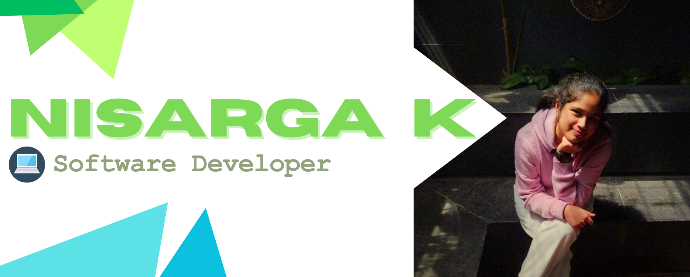

# Hey There! I'm Nisarga! 👋

## About Me 🚀
I'm a passionate & adaptive **developer** with professional experience in **Python**. I love building things through code!

- 🌱 Currently _learning_ **full stack development**
- 🔭 **Working on**: The Keystone Team at NetApp
- 🌍 **Languages**: _Primary_: Python, Go | _Secondary_: HTML, CSS, JavaScript, Java, C, C++
- ⚡ **Fun fact**: I used to be a state-level sprinter :)
- 💼 **Professional Experience**: [NetApp (_via DTL_)](Professional-Experience/Anakin.md) | [Anakin](Professional-Experience/Anakin.md)

## CV/Resume 📝
- My professional resume - [Resume](https://drive.google.com/file/d/1cVPnFKmYSVx3X8P1A_LpHbBC-_1e0B8l/view?usp=sharing)
- Check out my detailed [CV](https://drive.google.com/file/d/1t0CnhTrGmvxFPmqYDjPFTQRLaD5OxUtI/view?usp=sharing)!
- Or if you need a shorter summary here's my [personalized resume](https://drive.google.com/file/d/13NcPROUOqeQUPPJF42XqiLjdSMT4mFzl/view?usp=sharing)

## My Skills 🧠
- 
- 
- 
- 
-     
-  
- 
- 
- 

## Get in Touch 📬
- [LinkedIn](www.linkedin.com/in/nis-k)
- nisargakrishnappa@gmail.com

**P.S.:** _Why aren't my contributions to private company repos and branches lighting up my GitHub heatmap? If only GitHub could see all the work I’ve put in!_ 😓

**P.P.S.:** _My current org uses BitBucket 🥲_
